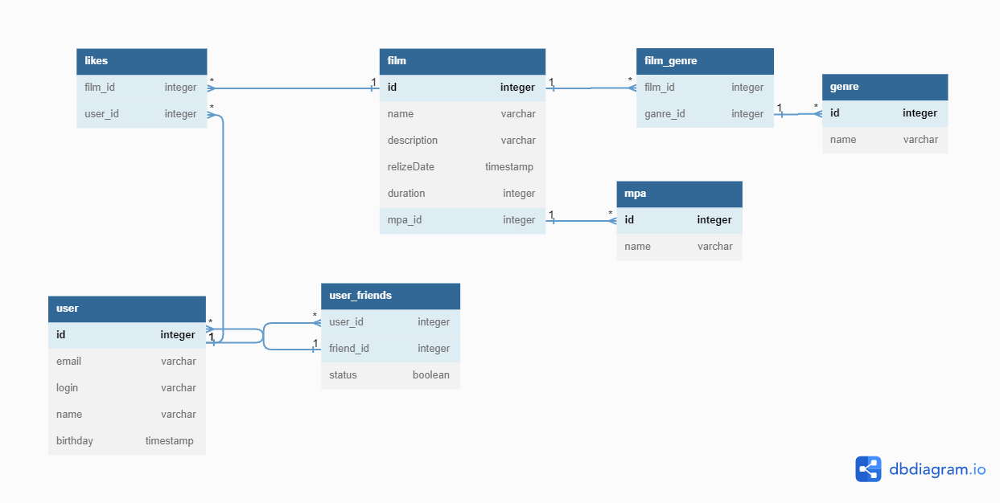

# java-filmorate
Template repository for Filmorate project.
# Схема базы данных

# Ссылка на dbdiagram: https://dbdiagram.io/d/645a67e4dca9fb07c4c6f4a4
CREATE TABLE "film" (
"id" integer PRIMARY KEY,
"name" varchar,
"description" varchar,
"relizeDate" timestamp,
"duration" integer,
"mpa_id" integer
);

CREATE TABLE "user" (
"id" integer PRIMARY KEY,
"email" varchar,
"login" varchar,
"name" varchar,
"birthday" timestamp
);

CREATE TABLE "user_friends" (
"user_id" integer,
"friend_id" integer,
"status" boolean
);

CREATE TABLE "likes" (
"film_id" integer,
"user_id" integer
);

CREATE TABLE "film_genre" (
"film_id" integer,
"ganre_id" integer
);

CREATE TABLE "genre" (
"id" integer PRIMARY KEY,
"name" varchar
);

CREATE TABLE "mpa" (
"id" integer PRIMARY KEY,
"name" varchar
);

ALTER TABLE "user_friends" ADD FOREIGN KEY ("user_id") REFERENCES "user" ("id");

ALTER TABLE "user" ADD FOREIGN KEY ("id") REFERENCES "user_friends" ("friend_id");

ALTER TABLE "mpa" ADD FOREIGN KEY ("id") REFERENCES "film" ("mpa_id");

ALTER TABLE "film_genre" ADD FOREIGN KEY ("film_id") REFERENCES "film" ("id");

ALTER TABLE "genre" ADD FOREIGN KEY ("id") REFERENCES "film_genre" ("ganre_id");

ALTER TABLE "likes" ADD FOREIGN KEY ("user_id") REFERENCES "user" ("id");

ALTER TABLE "likes" ADD FOREIGN KEY ("film_id") REFERENCES "film" ("id");

# Примеры запросов:
# Пример 1
SELECT u.id
FROM user AS u
WHERE email LIKE '%mail%'
LIMIT 10;

# Пример 2
SELECT *
FROM film AS f
ORDER BY f.name;

# Пример 3
SELECT m.name
COUNT(f.id)
FROM film AS f
LEFT OUTER JOIN mpa AS m ON f.mpa_id = m.id
GROUP BY f.mpa_id;